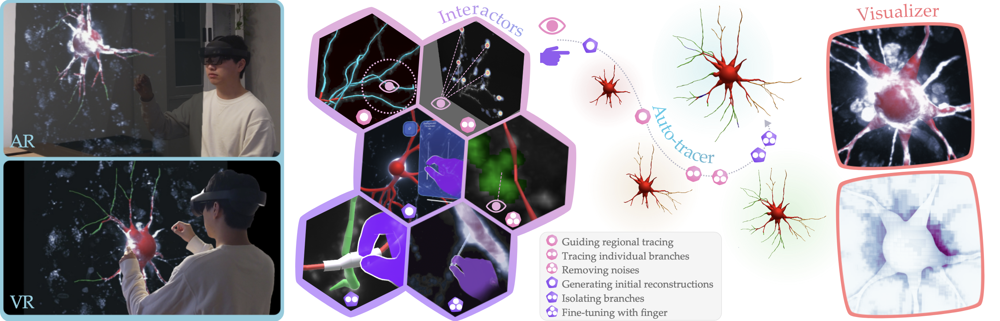

# Efficient and Accurate Semi-automatic Neuron Tracing with Extended Reality

_Jie Chen, Zexin Yuan, Jiaqi Xi, Ziqin Gao, Ying Li, Xiaoqiang Zhu, Yun Stone Shi, Frank Guan, and Yimin Wang_




**An overview of our method.**
(a) A user is conducting semi-automatic neuron tracing in an office-like extended reality environment with our developed method (exemplified using both an AR headset and a VR headset).
(b) A number of intuitive interactors designed in our method allow the user to apply guidance or constraints to the auto-tracer using eye- and gesture-based interactions.
(c) Guided by user inputs (as illustrated by the dashed timeline), the GPU-accelerated auto-tracer completes the neuron reconstruction in a progressive manner.
(d) Our method includes a dedicated visualizer that both handles the image-object occlusion correctly (upper panel) and accelerates volume rendering by avoiding unnecessary computations (bottom panel).

\[\[[paper](https://ieeexplore.ieee.org/document/10670414)\]\]
\[\[[project](https://github.com/neurogeom/XR_neuron_tracer)\]\]
\[\[[video](https://youtu.be/lnjTVp57cEE)\]\]

## Abstract

Neuron tracing, alternately referred to as neuron reconstruction, is the procedure for extracting the digital representation of the three-dimensional neuronal morphology from stacks of microscopic images.
Achieving accurate neuron tracing is critical for profiling the neuroanatomical structure at single-cell level and analyzing the neuronal circuits and projections at whole-brain scale.
However, the process often demands substantial human involvement and represents a nontrivial task.
Conventional solutions towards neuron tracing often contend with challenges such as non-intuitive user interactions, suboptimal data generation throughput, and ambiguous visualization.
In this paper, we introduce a novel method that leverages the power of extended reality (XR) for intuitive and progressive semi-automatic neuron tracing in real time.
In our method, we have defined a set of interactors for controllable and efficient interactions for neuron tracing in an immersive environment.
We have also developed a GPU-accelerated automatic tracing algorithm that can generate updated neuron reconstruction in real time.
In addition, we have built a visualizer for fast and improved visual experience, particularly when working with both volumetric images and 3D objects.
Our method has been successfully implemented with one virtual reality (VR) headset and one augmented reality (AR) headset with satisfying results achieved.
We also conducted two user studies and proved the effectiveness of the interactors and the efficiency of our method in comparison with other approaches for neuron tracing.

## Getting Started

1. Install Unity 2021.3.26f1c1.
2. Clone the repository.
3. Open the project with Unity.
4. Open the scene "INTraXR" in `Scenes/`.
5. Open the `scripts/configuration`, modify settings in the inspector.

## Folder Specification

```
XR_neuron_tracer/
├── Assets/
│   ├── Materials/
│   ├── Resources/
│   │   ├── ComputeShaders/
│   │   │   ├── ErrorHeatMap.compute        // For compute the error heat map of the reconstruction results
│   │   │   ├── FIM.compute                 // Kernels of fast iterative methods (FIM) reconstruction
│   │   │   ├── OccupancyMap.compute        // Compute occupancy for chebyshev volume rendering acceleration
│   │   │   ├── ParallelDistanceMap.compute // Compute distancemap for chebyshev volume rendering acceleration
│   │   │   └── Utility.compute
│   │   ├── Prefabs/
│   │   │   ├── AutoMenu.prefab             // Menu for auto reconstruction and guiding regional tracing
│   │   │   ├── EyeMenu.prefab              // Menu for tracing individual branches and removing noises
│   │   │   ├── IsolateMenu.prefab          // Menu for isolating branches
│   │   │   ├── HandMenuBase.prefab         // Menu for main menu
│   │   │   └── PaintingBoard.prefab        // Parent transform of reconstruction and neuronal image
│   │   └── Textures/                       // Materials in different colors of reconstruction
│   ├── Scenes/
│   │   └── INTraXR.unity                   // Main scene
│   ├── Scripts/
│   │   ├── Config.cs                       // Configuration of reconstruction
│   │   ├── Command/                        // Commands, e.g. replay
│   │   ├── Menu/
│   │   ├── Mutiplayer/
│   │   ├── NeuronEditing/
│   │   │   ├── GazeController.cs           // Controlling the eye tracking interaction
│   │   │   ├── GestureController.cs        // Controlling the hand gesture interaction
│   │   │   ├── PipeCasing.cs               // Pipecasing for signal isolating
│   │   │   └── Primitive.cs                // Reconstruction neuron from markers
│   │   ├── NeuronTracing/
│   │   │   ├── FIM.cs                      // Reconstruction with FIM boosted by compute shader
│   │   │   ├── HierarchyPruning.cs         // Refining
│   │   │   ├── Tracer.cs                   // Neuron tracing
│   │   │   └── VirutalFinger.cs            // Manual reconstruction
│   │   ├── Utility/
│   │   │   ├── ErrorHeatMapCompute.cs
│   │   │   ├── Importer.cs                 // Import the neuronal image from TIFF or v3dpbd
│   │   │   ├── LoadSwc.cs                  // Load reconstructed neuron file swc
│   │   │   └── OccupancyMapCompute.cs
│   │   └── Visualization/
│   │       └── PostProcess.cs              // For volume rendering of neuronal image with post process
│   ├── Shaders/
│   │   ├── VRAccelerated.shader            // Volume rendering accelerated with chebyshev distance
│   │   ├── VRBase.shader                   // Volume rendering without any acceleration
│   │   ├── VRFixedThresh.shader            // Volume rendering with fixed background threshold
│   │   └── VRFlexibleThresh.shader         // Volume rendering with area background threshold
│   └── Textures/                           // Texture of neuronal images and processed images
├── MRTK3/                                  // Packages of MRTK3
└── Packages/                               // Packages configuration
```

## Citation

```bibtex
@ARTICLE{chen_efficient_2024,
  author={Chen, Jie and Yuan, Zexin and Xi, Jiaqi and Gao, Ziqin and Li, Ying and Zhu, Xiaoqiang and Shi, Yun Stone and Guan, Frank and Wang, Yimin},
  journal={IEEE Transactions on Visualization and Computer Graphics},
  title={Efficient and Accurate Semi-Automatic Neuron Tracing with Extended Reality},
  year={2024},
  volume={30},
  number={11},
  pages={7299-7309},
  keywords={Neurons;Image reconstruction;Accuracy;Manuals;Visualization;Extended reality;Three-dimensional displays;Extended Reality;Neuron Tracing;Visualization;Human-centered Computing;Eye Tracking},
  doi={10.1109/TVCG.2024.3456197}}
```

Welcome to contact us <chenjie_at_gdiist_dot_cn> or <yuanzexin_at_gdiist_dot_cn> for any question.
